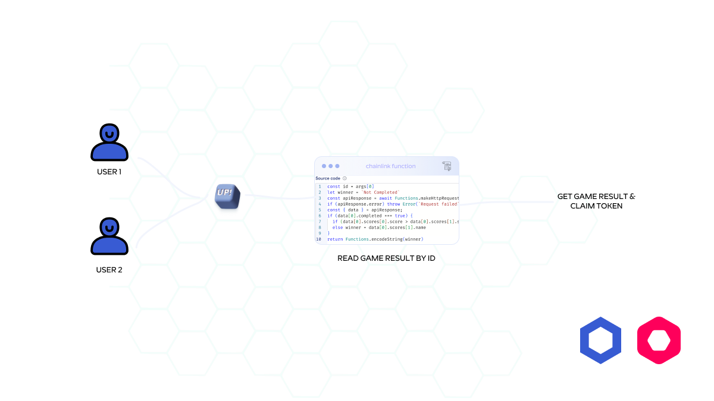

# Webet

At Webet, you will trust a verified smart contract that uses **Chainlink Function** to read sports results to announce the winner.

## Dome 🚀
[https://api.yumsee.menu/](https://api.yumsee.menu/) 

## Contract Address
[0xBab7309F6e871b3cD015f43f1774C1F95679CF8E](https://mumbai.polygonscan.com/address/0xBab7309F6e871b3cD015f43f1774C1F95679CF8E)

## Function Subscription

## Inspiration
The gambling industry is ripe for disruption with the advent of blockchain technology. Blockchain-powered gambling Dapps can offer a host of advantages over traditional online casinos, including Enhanced security and transparency, Decentralized governance, and User ownership and control.
## What it does
After starting a game/ sport users can bet on a game with an equal amount of tokens e.g. 15 LINK then a smart contract can be kept in the pool(smart contract pool), next the winner or all users can send a request to the blockchain to see winner and claim tokens. It uses the Chainlink function to read which team is a winner in a play.
## How we built it
Used react for front-end, web3js to call contract APIs for sending requests to the Chainlink function and a smart contract containing Chainlink function to read data.
## Challenges we ran into
Debugging a Chainlink function was difficult for me despite of I used Chainlink function playground, so I decided to log all requests in my server (when a Chainlink function runs) e.g. (36
4275f59e3fbef9a01b3007538c0b61fc
2023-12-10 16:56:33)
## Accomplishments that we're proud of
I could write a Chainlink Function-based smart contract to fetch data from web2, that was amazing!
## What we learned
I learned about the Chainlink function and its purposes, how to call my APIs which was my concern in other projects, how to subscribe to the Chainlink function and add consumer addresses, etc.
## What's next for Webet
I have a lot of TODOs in my list to develop and make it a cool betting dapp 